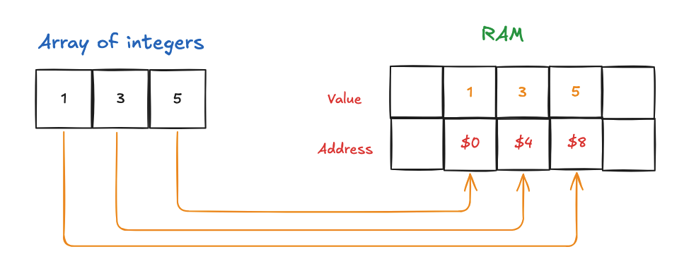

# Data Structures and Algorithms (following Neetcode course)

<p align="center">
  
</p>

## RAM

Data structure is a way to store data in an efficient manner inside of a computer component called `Random Access Memory (RAM)`. An array is a data structure which is used to store the elements in a contiguous order. When we store an array in RAM, each element is stored continuously in order. An integer takes 4 bytes of space in the memory and each byte has 8 bits. A `bit` is a fundamental unit of memory that stores either `1 or 0`. An `address` and `value` gets associated with an integer upon storing it in RAM. An address is just a distinct location that each one of its values is stored at. Each value is stored continuously in the RAM.

Some calculations:

- 1 byte = `8 bits`
- 4 bytes = 8 * 4 = `32 bits`
- Representation of integer 1 in binary - `0000 0000 0000 0000 0000 0000 0000 0001`



### C++ code reference

```cpp
#include <iostream>

int main() {
    int arr[] = {1, 3, 5};
    for(int i = 0; i < 3; i++){
        std::cout << "Address of element " << arr[i] << " is " << &arr[i] << '\n';
    }
    // 1 byte = 8 bits
    // 4 bytes = 8 * 4 = 32 bits (an integer takes 4 bytes or 32 bits in memory)
    std::cout << "You can see the addresses are incrementing by 4 bytes which means an integer takes 4 bytes in memory\n";
    return 0;
}
```

### Terminal output

```text
// Addresses are incremented by 4 bytes
1 0x7ff7bb40addc
3 0x7ff7bb40ade0
4 0x7ff7bb40ade4
```


## Static Arrays

In statically typed languages like Java, C++ and C#, arrays have to have an allocated `size` and `type`. The size and type of the array cannot be changed once declared. In languages like Python and JavaScript, we have dynamic arrays which can change their size during runtime.

| **Operation** | **Big-O Time** | **Notes** |
|---------------|----------------|-----------|
| Reading       | O(1)           |           |
| Insertion     | O(n)*          | If inserting at the end of the array, O(1) |
| Deletion      | O(n)*          | If deleting at the end of the array, O(1) |